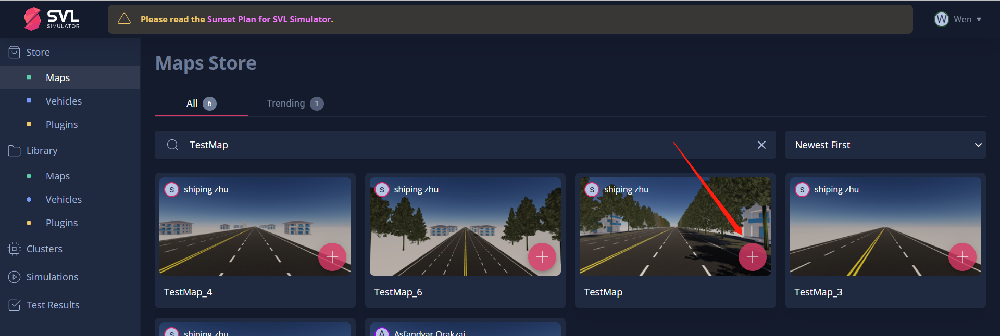
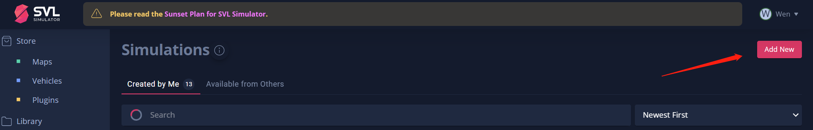
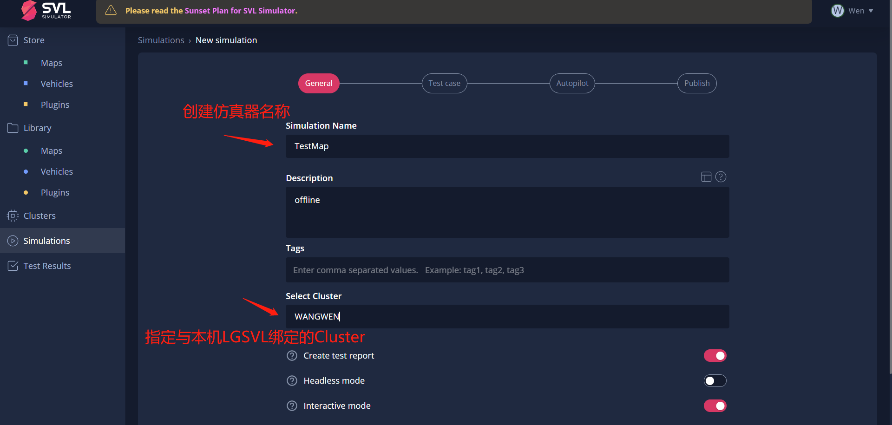
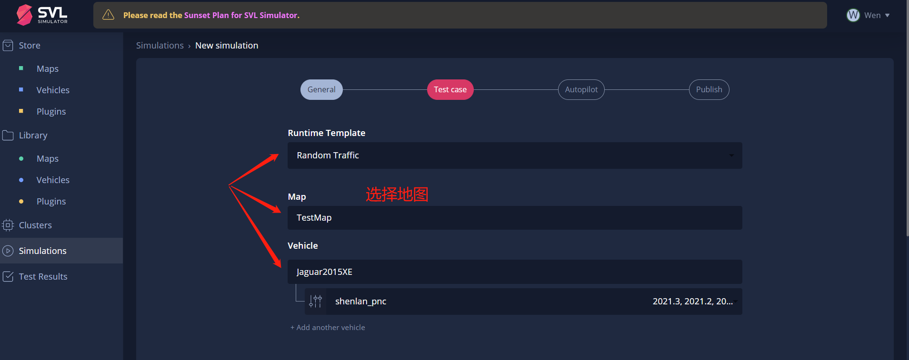
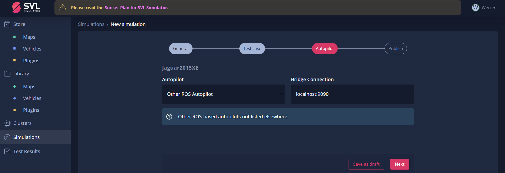
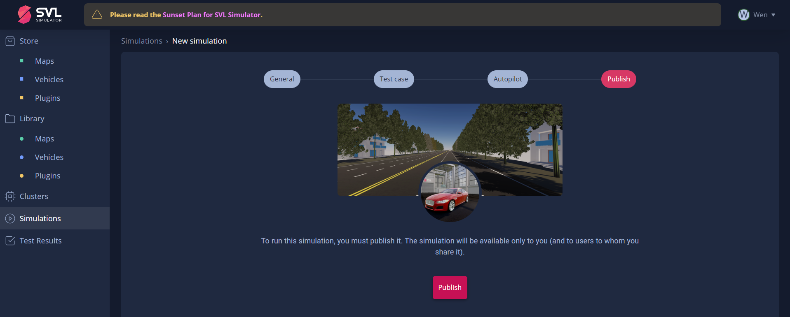
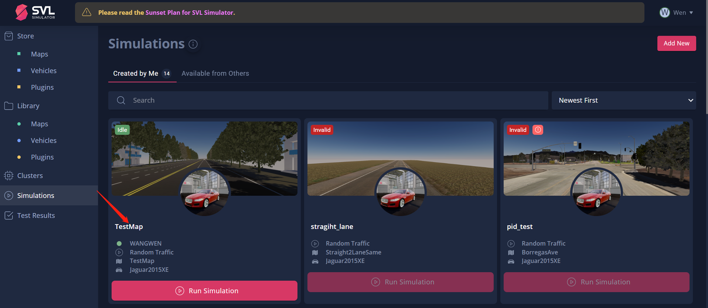
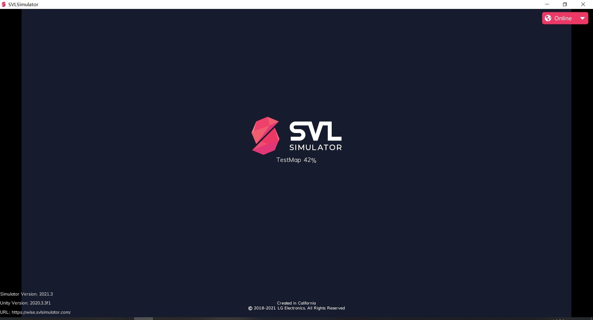
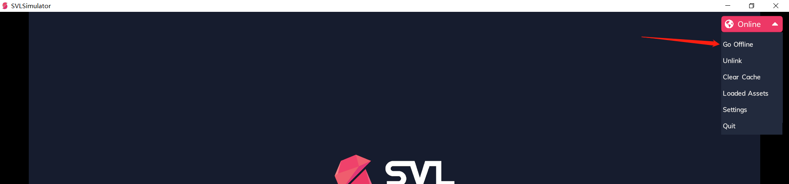
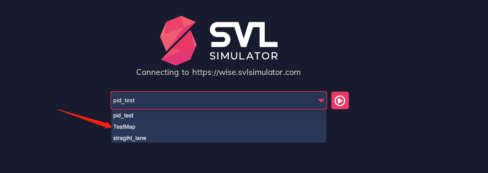

### 规控课程仿真本例运行实例

> 以TestMap为例介绍如何时间LGSVL离线运行，防止后续平台关闭无法在线使用

1. 将`TestMap`从`Store Map`中添加至账户的`Library`中
   

2.  为每一个地图创建专属的仿真器

   

   

3. 确认仿真模式为随机交通、地图`TestMap`以及汽车配置	

   

   

4. 选择我们的ros平台以及确认通信的ip 地址

   

5.  点击Publish完成我们的仿真器创建 
   

6. 在`Simulatons` 中运行我们刚刚创建的仿真器TestMap   

   

7.  等待从服务器中下载地图等环境配置至本地，仿真运行后点击停止。

   

8.  点击`offline`, 选定我们刚才创建的TestMap  仿真器，点击运行即可

   

   

在后续运行过程中，无需在现行联网等操作，在Offline中选择我们根据不同地图所创建的仿真环境允许即可，对于课程所需要的其他地图，同学们可以根据这种方式进行创建。

